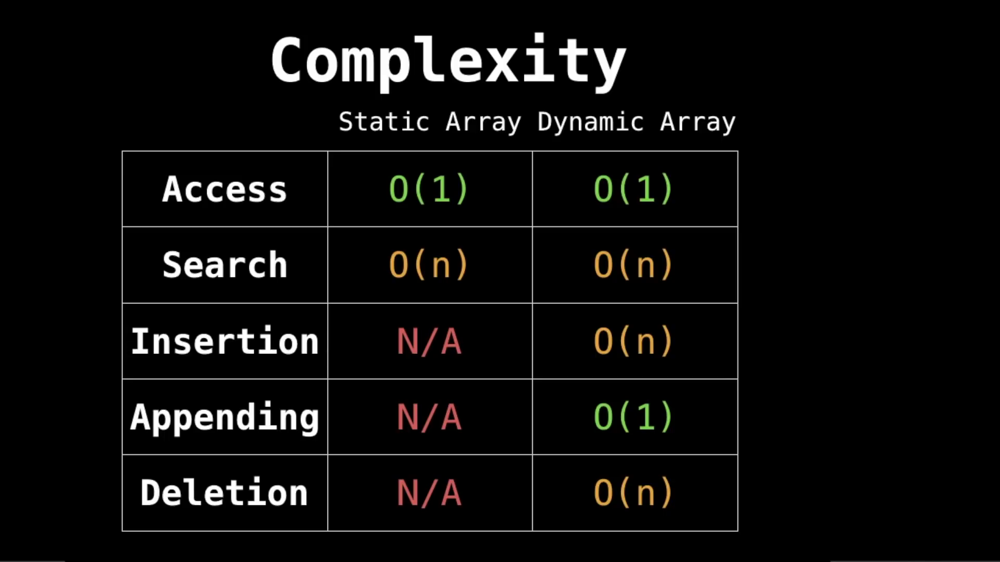
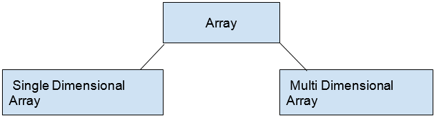

# Array

A static array container containing n elements indexable from the range [0, n-1] in contiguous memory.

## Static Array 
Static arrays store their values on the stack, and their size must be known at compile time.

## Dynamic Array
Dynamic arrays are those arrays which are allocated memory at the run time with the help of heap.Thus Dynamic array can change its size during run time.

## When and where is Static Array used.
1. Storing and Accessing sequential data.

2. Temporarily storing objects.

3. Lookup tables and Inverse Lookup tables.

4. Used in Dynamic Programming to cache answers to subproblems.

## Types of Array 

### Single Dimensional Array
The single-dimensional array may be defined as the type of array that is capable to hold the values of the same datatype in the form of a list.

### Multi Dimensional Array
The multidimensional array may be defined as the array that holds the values in the way a matrix does. The two-dimensional array is used very often and with the increase in the size of dimension, the array gets complicated.
