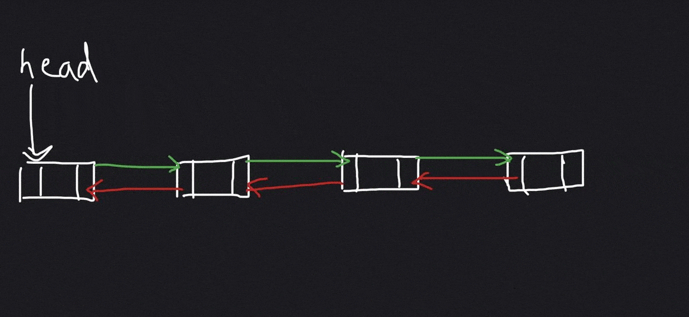
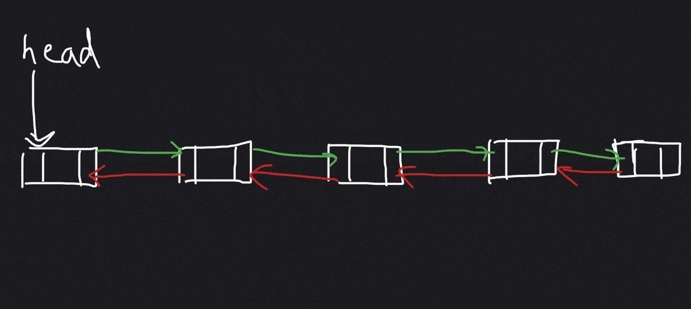
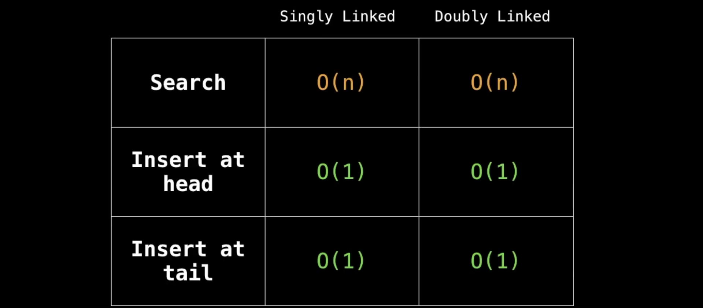

# Linked List
A linked list is a sequential list of nodes that hold data which point to others nodes containing data.

## Where are Linked lists used ?
1. Linked lists are used in many Lists, stack, queue implentation.

2. Can be easily modeled as real world objects such as trains.

3. Used in Separate Chaining for avoiding Hash Collision.

4. Used in implementing adjancey lists for graphs.

## Singly Linked List
Singly Linked List only holds refrence to the next node. 

### Implementation Simple Linked List
Addition of Node

Deleting a node

### Implementation of Circular Linked List
Circular Linked List is similar to Simple Linked List. And the last node stores the refrence to the first node.
Addition of Node

Deleting a Node

## Doubly Linked List
In Doubly Linked List each node refers to its next and previous nodes.

Adding a Node

Deleting a Node

## Complexity Analysis of Linked Lists

