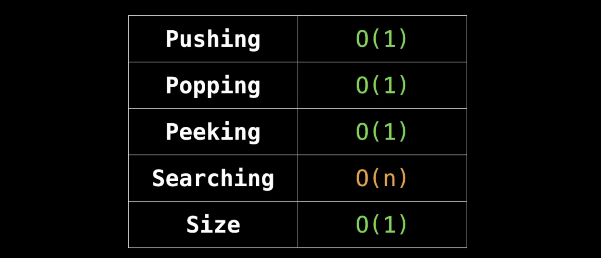

# STACK
A stack is a one-ended linear data structure which models a real world stack by having two primary operations, namely push and pop.
It uses LIFO (Last In First Out)

## Where is Stack used ?
->	Used by undo mechanism in text editors.

->	Used in compiler syntax checking for matching brackets and braces.

->	Can be used to model a pile of books or plates.

->	Can be used to do a Depth First Search (DFS).,

## Basic Operations of Stack

### Push :
Adds an item in the stack. If the stack is full, then it is said to be an Overflow condition.

### Pop :
Removes an item from the stack. The items are popped in the reversed order in which they are pushed. If the stack is empty, then it is said to be an Underflow condition

### Peek / Top :
Returns top element of stack.

### isEmpty :
Returns true if stack is empty, else false.

### Implementaion of stack using Linked List.
>	Push() operation can be implemented by inserting the nodes at the head.

>	Pop() operation can be implemented by deleting it from head and shifting head pointer to next node.

>	Tower of Hanoi problem can be solved using stack.

## Complexity Analysis

