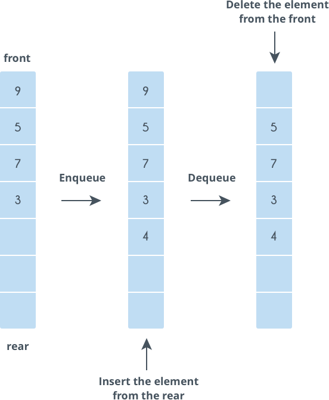
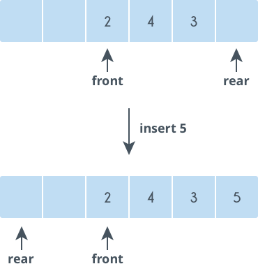
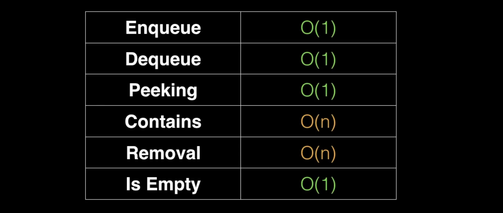

# Queue
A queue is a linear data structure which models real world queues by having two primary operations, namely enqueue (Adding/Offering) and dequeue (Polling/Removing).
It uses FIFO (First In First Out).

## When and Where is Queue is used ?
->	 Any waiting line models is a queue.

->	 Can be used to efficiently keep track of x most recent elements.

->   Web server request management where you want first come first service.

->	 Breadth First Search (BFS) graph traversal. 

## Queue Operations
### Enqueue :
If the queue is not full, this function adds an element to the back of the queue, else it prints “OverFlow”.

### Dequeue :
If the queue is not empty, this function removes the element from the front of the queue, else it prints “UnderFlow”.

### Front :
This function returns the front element of the queue.

## Variations in Queue
The standard queue data structure has the following variations:

a) Double-ended queue

b) Circular queue

### Double-ended queue
In a standard queue, a character is inserted at the back and deleted in the front. However, in a double-ended queue, characters can be inserted and deleted from both the front and back of the queue.

### Circular queue
A circular queue is an improvement over the standard queue structure. In a standard queue, when an element is deleted, the vacant space is not reutilized. However, in a circular queue, vacant spaces are reutilized.

While inserting elements, when you reach the end of an array and you need to insert another element, you must insert that element at the beginning (given that the first element has been deleted and the space is vacant).

## Complexity Analysis

