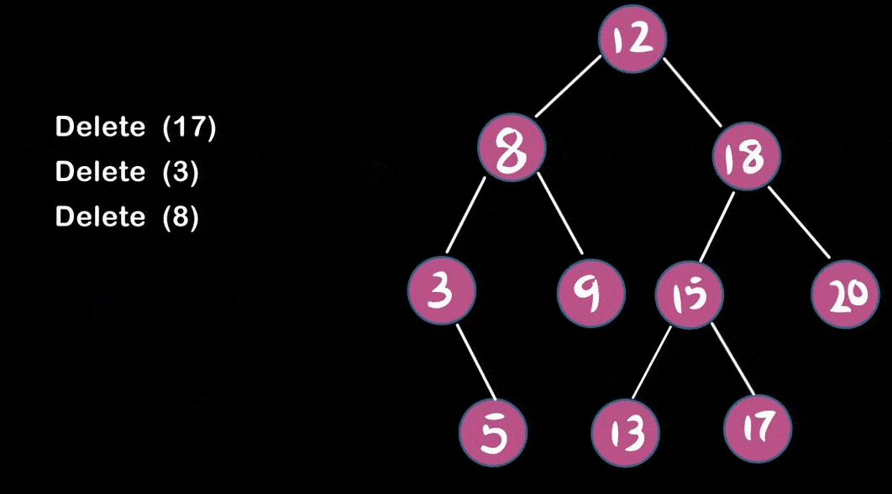

# TREE

A tree is a nonlinear hierarchical data structure that consists of nodes connected by edges. It is an Undirected graph which follows any of the following properties :

-> An acyclic connected Graph. (No cycles are present)

-> graph has **N** nodes and **N-1** edges.

-> in which any two **Vertices** are connected by one path.

## Why Tree Data Structure ?
-> Different tree data structures allow quicker and easier access to the data as it is a non-linear data structure.

-> It offers an efficient search and insertion procedure.

-> The trees are flexible. This allows subtrees to be relocated with minimal effort.

## Basic Tree Terminologies :

**Node :** A node is an entity that contains a key or value and pointers to its child nodes.

**Edge :** It is the link between any two nodes.

**Root Node :** The root node is the topmost node in the tree hierarchy. In other words, the root node is the one which doesn't have any parent.

**Leaf Node :** The node of tree, which doesn't have any child node, is called leaf node. Leaf node is the bottom most node of the tree.

**Degree :** Degree of a node is equal to number of children, a node have.

**Subtree :** Subtree represents the descendants of a node. Also known as **_Forest_**.

**Height of a Tree :** The height of a Tree is the height of the root node or the depth of the deepest node.

## Types of Trees

### 1. General Tree
If no constraint is placed on the hierarchy of the tree, a tree is called a general tree. Every node may have infinite numbers of children in General Tree. The tree is the super-set of all other trees.

### 2. Binary Tree
A Binary Tree is a tree for which every node has **atmost two child nodes**.

Types of Binary Tree :

**a) Full Binary Tree :** A full Binary tree is a special type of binary tree in which every parent node/internal node has either two or no children.

**b) Perfect Binary Tree :** A perfect binary tree is a type of binary tree in which every internal node has exactly two child nodes and all the leaf nodes are at the same level.

**c) Complete Binary Tree :** A Binary Tree is a complete Binary Tree if all the levels are completely filled except possibly the last level and the last level has all keys as left as possible.

**d) Balanced Binary Tree :** A binary tree is balanced if the height of the tree is O(Log n) where n is the number of nodes. And the difference between the left and the right subtree for each node is either 0 or 1. Balanced Binary Search trees are performance-wise good as they provide O(log n) time for search, insert and delete. 

**e) Degenerate or Pathological Tree :** A degenerate or pathological tree is the tree having a single child either left or right.

**f) Skewed Binary Tree :** A skewed binary tree is a pathological/degenerate tree in which the tree is either dominated by the left nodes or the right nodes. Thus, there are two types of skewed binary tree: **_left-skewed binary tree_** and **_right-skewed binary tree_**.

### 3. Binary Search Tree
A Binary Search Tree is a Binary Tree that satisfies BST invariant. i.e, The properties that separate a binary search tree from a regular binary tree are :

**_-> All nodes of left subtree are less than the root node._**

**_-> All nodes of right subtree are more than the root node._**

**_->Both subtrees of each node are also BSTs i.e. they have the above two properties._**

**When and Where is Binary Search Tree used ?**

-> Implementation of some maps and set Abstract Data Types.

-> Implementation of AVL trees, Red Black Trees, Splay Trees.

-> Used in implementation of binary heaps.

**Complexity Analysis of Binary Tree**

**Adding Elements in BST**

**Deleting Elements in BST**

**Case I :** In the first case, the node to be deleted is the leaf node. In such a case, simply delete the node from the tree.

**Case II :** In the second case, the node to be deleted lies has a single child node. In such a case follow the steps below:

1. Replace that node with its child node.

2. Remove the child node from its original position.

**Case III :** In the third case, the node to be deleted has two children. In such a case follow the steps below:

1. Get the inorder successor of that node.

2. Replace the node with the inorder successor.

3. Remove the inorder successor from its original position.

### 3. a) AVL Tree
AVL tree is a self-balancing binary search tree in which each node maintains extra information called a balance factor whose value is either -1, 0 or +1.

AVL tree got its name after its inventor Georgy Adelson-Velsky and Landis.

Balance factor of a node in an AVL tree is the difference between the height of the left subtree and that of the right subtree of that node.

Balance Factor = (Height of Left Subtree - Height of Right Subtree)

