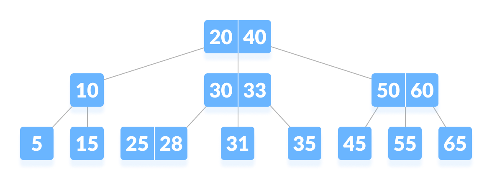

# TREE

A tree is a nonlinear hierarchical data structure that consists of nodes connected by edges. It is an Undirected graph which follows any of the following properties :

-> An acyclic connected Graph. (No cycles are present)

-> graph has **N** nodes and **N-1** edges.

-> in which any two **Vertices** are connected by one path.

## Why Tree Data Structure ?
-> Different tree data structures allow quicker and easier access to the data as it is a non-linear data structure.

-> It offers an efficient search and insertion procedure.

-> The trees are flexible. This allows subtrees to be relocated with minimal effort.

## Basic Tree Terminologies :

**Node :** A node is an entity that contains a key or value and pointers to its child nodes.

**Edge :** It is the link between any two nodes.

**Root Node :** The root node is the topmost node in the tree hierarchy. In other words, the root node is the one which doesn't have any parent.

**Leaf Node :** The node of tree, which doesn't have any child node, is called leaf node. Leaf node is the bottom most node of the tree.

**Degree :** Degree of a node is equal to number of children, a node have.

**Subtree :** Subtree represents the descendants of a node. Also known as **_Forest_**.

**Height of a Tree :** The height of a Tree is the height of the root node or the depth of the deepest node.

 

## Types of Trees

### 1. General Tree
If no constraint is placed on the hierarchy of the tree, a tree is called a general tree. Every node may have infinite numbers of children in General Tree. The tree is the super-set of all other trees.

### 2. Binary Tree
A Binary Tree is a tree for which every node has **atmost two child nodes**.

Types of Binary Tree :

**a) Full Binary Tree :** A full Binary tree is a special type of binary tree in which every parent node/internal node has either two or no children.

**b) Perfect Binary Tree :** A perfect binary tree is a type of binary tree in which every internal node has exactly two child nodes and all the leaf nodes are at the same level.

**c) Complete Binary Tree :** A Binary Tree is a complete Binary Tree if all the levels are completely filled except possibly the last level and the last level has all keys as left as possible.

**d) Balanced Binary Tree :** A binary tree is balanced if the height of the tree is O(Log n) where n is the number of nodes. And the difference between the left and the right subtree for each node is either 0 or 1. Balanced Binary Search trees are performance-wise good as they provide O(log n) time for search, insert and delete. 

**e) Degenerate or Pathological Tree :** A degenerate or pathological tree is the tree having a single child either left or right.

**f) Skewed Binary Tree :** A skewed binary tree is a pathological/degenerate tree in which the tree is either dominated by the left nodes or the right nodes. Thus, there are two types of skewed binary tree: **_left-skewed binary tree_** and **_right-skewed binary tree_**.

### 3. Binary Search Tree
A Binary Search Tree is a Binary Tree that satisfies BST invariant. i.e, The properties that separate a binary search tree from a regular binary tree are :

**_-> All nodes of left subtree are less than the root node._**

**_-> All nodes of right subtree are more than the root node._**

**_->Both subtrees of each node are also BSTs i.e. they have the above two properties._**

**When and Where is Binary Search Tree used ?**

-> Implementation of some maps and set Abstract Data Types.

-> Implementation of AVL trees, Red Black Trees, Splay Trees.

-> Used in implementation of binary heaps.

**Complexity Analysis of Binary Tree**

.

**Adding Elements in BST**

.

**Deleting Elements in BST**

**Case I :** In the first case, the node to be deleted is the leaf node. In such a case, simply delete the node from the tree.

**Case II :** In the second case, the node to be deleted lies has a single child node. In such a case follow the steps below:

1. Replace that node with its child node.

2. Remove the child node from its original position.

**Case III :** In the third case, the node to be deleted has two children. In such a case follow the steps below:

1. Get the inorder successor of that node.

2. Replace the node with the inorder successor.

3. Remove the inorder successor from its original position.

### 3. a) AVL Tree
AVL tree is a self-balancing binary search tree in which each node maintains extra information called a _balance factor_ whose value is either **-1, 0 or +1.**

AVL tree got its name after its inventor Georgy Adelson-Velsky and Landis.

Balance factor of a node in an AVL tree is the difference between the height of the left subtree and that of the right subtree of that node.

**Balance Factor** = (Height of Left Subtree - Height of Right Subtree)

**Operations on AVL Tree**

**1. Left Rotation** 

In left-rotation, the arrangement of the nodes on the right is transformed into the arrangements on the left node.

**2. Right Rotation**

In right-rotation, the arrangement of the nodes on the left is transformed into the arrangements on the right node.

**3. Left-Right Rotation**

In left-right rotation, the arrangements are first shifted to the left and then to the right.

**4. Right-Left Rotation**

In right-left rotation, the arrangements are first shifted to the right and then to the left.

**Inserting Nodes in AVL tree**

**Deleting Nodes in AVL tree**

### 3. b) Red Black Trees

A red-black tree is a kind of self-balancing binary search tree where each node has an extra bit, and that bit is often interpreted as the colour (red or black).

**_Properties of Red Black Trees_**

1. Every node has a colour either red or black.

2. The root of tree is always black.

3. There are no two adjacent red nodes (A red node cannot have a red parent or red child).

4. Every path from a node (including root) to any of its descendant NULL node has the same number of black nodes.

**Insertion**
In the Red-Black tree, we use two tools to do the balancing. 

_a) Recoloring  
b) Rotation_  

Recolouring is the change in colour of the node i.e. if it is red then change it to black and vice versa. It must be noted that the colour of the NULL node is always black. Moreover, we always try recolouring first, if recolouring doesn’t work, then we go for rotation. Following is a detailed algorithm. The algorithms have mainly two cases depending upon the colour of the uncle. If the uncle is red, we do recolour. If the uncle is black, we do rotations and/or recolouring.
 
  

_**Step 1:** First, you have to insert the node similarly to that in a binary tree and assign a red colour to it. 
**Step 2:** If the node is a root node then change its colour to black, but if it does not then check the colour of the parent node. If its colour is black then don’t change the colour but if it is not i.e. it is red then check the colour of the node’s uncle.  
**step 3:** If the node’s uncle has a red colour then change the colour of the node’s parent and uncle to black and that of grandfather to red colour and repeat the same process for him (i.e. grandfather)._  
  
_**Step 4:** But, if the node’s uncle has black colour then there are 4 possible cases:_
Left Left Case (LL rotation): 
  
Left Right Case (LR rotation): 
  
Right Right Case (RR rotation): 
  
Right Left Case (RL rotation): 
  
 
_Now, after these rotations, if the colours of the nodes are miss matching then recolour them._

**Deletion in Red Black Tree**
 
In insert operation, we check color of uncle to decide the appropriate case. In delete operation, we check color of sibling to decide the appropriate case.

The main property that violates after insertion is two consecutive reds. In delete, the main violated property is, change of black height in subtrees as deletion of a black node may cause reduced black height in one root to leaf path.

Deletion is fairly complex process.  To understand deletion, notion of double black is used.  When a black node is deleted and replaced by a black child, the child is marked as double black. The main task now becomes to convert this double black to single black.

_**Step 1:** Perform standard BST deletion.  
**Step 2:** **Case 1: Either u or v are red**  
 
**Step 3: If Both u and v are Black.**  
**3.1:** Color u as double black. 
 
**3.2:** The current node u is double black and it is not root. Let sibling of node be s. 
**(a): If sibling s is black and at least one of sibling’s children is red, perform rotation(s). Let the red child of s be r. This case can be divided in four subcases depending upon positions of s and r. 
…………..(i) Left Left Case (s is left child of its parent and r is left child of s or both children of s are red). This is mirror of right right case shown in below diagram. 
…………..(ii) Left Right Case (s is left child of its parent and r is right child). This is mirror of right left case shown in below diagram. 
…………..(iii) Right Right Case (s is right child of its parent and r is right child of s or both children of s are red) 
 
…………..(iv) Right Left Case (s is right child of its parent and r is left child of s)** 
 
**(b): If sibling is black and its both children are black, perform recoloring, and recur for the parent if parent is black.** 
 
**(c): If sibling is red, perform a rotation to move old sibling up, recolor the old sibling and parent. The new sibling is always black (See the below diagram). This mainly converts the tree to black sibling case (by rotation) and  leads to case (a) or (b). This case can be divided in two subcases. 
…………..(i) Left Case (s is left child of its parent). This is mirror of right right case shown in below diagram. We right rotate the parent p. 
…………..(iii) Right Case (s is right child of its parent). We left rotate the parent p.** 
 
**3.3)** If u is root, make it single black and return (Black height of complete tree reduces by 1). _

**Applications of Red Black Tree** 
-> To implement finite maps.

-> To implement Java packages: java.util.TreeMap and java.util.TreeSet

-> To implement Standard Template Libraries (STL) in C++: multiset, map, multimap

-> In Linux Kernel

### 4. B Tree

B-tree is a special type of self-balancing search tree in which each node can contain more than one key and can have more than two children. It is a generalized form of the binary search tree.

It is also known as a height-balanced m-way tree.

**Why B Tree ?**

The need for B-tree arose with the rise in the need for lesser time in accessing the physical storage media like a hard disk. The secondary storage devices are slower with a larger capacity. There was a need for such types of data structures that minimize the disk accesses.

Other data structures such as a binary search tree, avl tree, red-black tree, etc can store only one key in one node. If you have to store a large number of keys, then the height of such trees becomes very large and the access time increases.

However, B-tree can store many keys in a single node and can have multiple child nodes. This decreases the height significantly allowing faster disk accesses.
