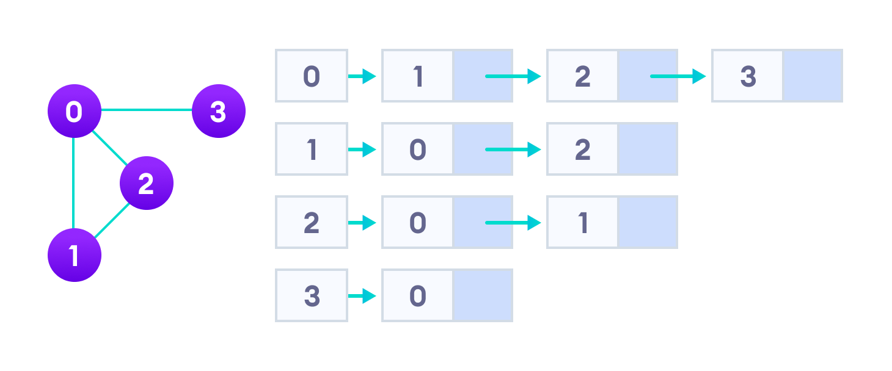

# GRAPHS

A graph data structure is a collection of nodes that have data and are connected to other nodes.

More precisely, a graph is a data structure (V, E) that consists of

-> A collection of vertices V  
-> A collection of edges E, represented as ordered pairs of vertices (u,v)  

## Graph Terminology 
**Adjacency:** A vertex is said to be adjacent to another vertex if there is an edge connecting them.  
**Path:** A sequence of edges that allows you to go from vertex A to vertex B is called a path. 
**Directed Graph:** A graph in which an edge (u,v) doesn't necessarily mean that there is an edge (v, u) as well. The edges in such a graph are represented by arrows to show the direction of the edge.  

## Graph Representation
Graphs are commonly represented in two ways:

### 1. Adjacency Matrix
An adjacency matrix is a 2D array of V x V vertices. Each row and column represent a vertex.  
If the value of any element a[i][j] is 1, it represents that there is an edge connecting vertex i and vertex j.  
  
**_Since it is an undirected graph, for edge (0,2), we also need to mark edge (2,0); making the adjacency matrix symmetric about the diagonal._**  

Edge lookup(checking if an edge exists between vertex A and vertex B) is extremely fast in adjacency matrix representation but we have to reserve space for every possible link between all vertices(V x V), so it requires more space. 

### 2. Adjacency List
An adjacency list represents a graph as an array of linked lists. 
The index of the array represents a vertex and each element in its linked list represents the other vertices that form an edge with the vertex. 
 
An adjacency list is efficient in terms of storage because we only need to store the values for the edges. For a graph with millions of vertices, this can mean a lot of saved space.  

## Graph Operations
The most common graph operations are:

_-> Check if the element is present in the graph  
-> Graph Traversal  
-> Add elements(vertex, edges) to graph  
-> Finding the path from one vertex to another_  
